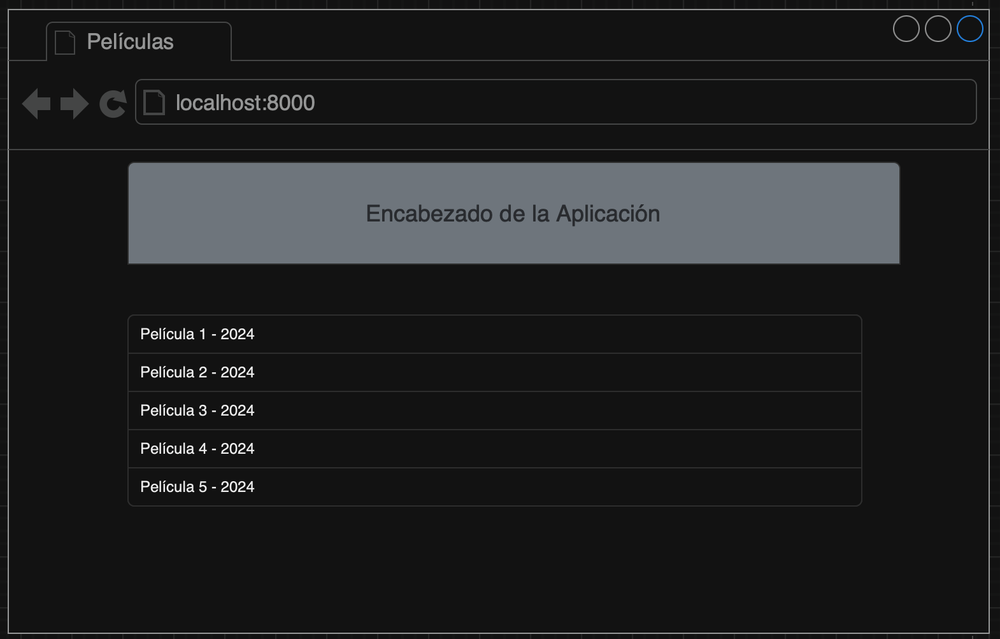
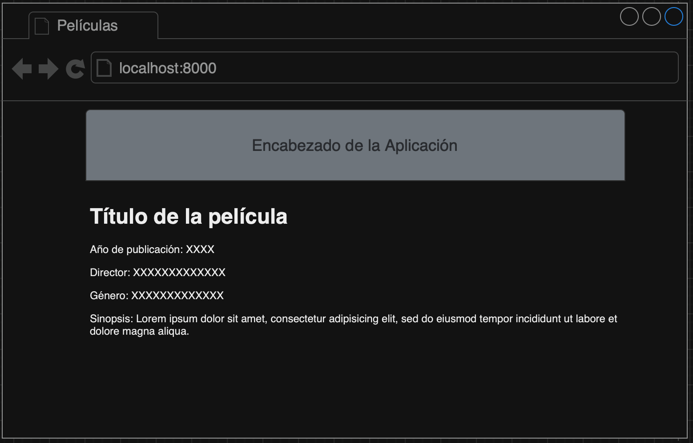

# Examen Parcial 2. Django: Vistas, Templates y Modelos

En el presente examen se evaluarán los conocimientos de los estudiantes sobre el desarrollo de interfaces web utilizando el patrón Modelo-Vista-Controlador (MVC) con Django, HTML y CSS.

Para el examen se propone crear un catálogo de pelíclas que se mostrarán en una vista Maestro - Detalle.

## Objetivos 

### 1. Reconocimiento y Aplicación de Conceptos Básicos de POO
El estudiante debe demostrar su capacidad para reconocer y aplicar conceptos fundamentales del Paradigma Orientado a Objetos (POO) tales como clases, objetos, atributos y métodos.

### 2. Desarrollo de Aplicaciones Web con Django
Este proyecto servirá como una introducción al desarrollo de aplicaciones web mediante el uso de Django como framework. El estudiante debe ser capaz de utilizar modelos en Django para reforzar sus conocimientos sobre POO y el manejo de bases de datos relacionales.

### 3. Diseño de Interfaces Gráficas Web
El estudiante debe ser capaz de desarrollar interfaces gráficas web utilizando HTML y CSS, mostrando un entendimiento sólido de cómo construir y estilizar páginas web de manera efectiva.

## Reglas del examen
Los estudiantes podrán usar los recursos usados en clase tales como laboratorios, diapositivas, apuntes. Así como consultas en StackOverflow y sitios de consulta para desarrolladores.

**No se permite el uso de: Chats como Whatsapp, Microsoft Teams, Google Chat, Telegram, entre otros; así como tampoco se permite el uso de inteligencia artificial generativa**

Las consultas sobre cualquier inquietud se deberá hacer únicamente al docente.

**Cualquier intento de fraude anulará el presente examen, pasará al registro con la nota de Cero y se informará a la coordinación de la carrera para tomar las acciones pertinentes de acuerdo al reglamento de la institución**.

## Tareas a realizar
1. **Generación de Modelos 'Movie'.** El modelo representa una película deberá tener los siguientes atributos.
    - Id
    - Título de la película
    - Género de la Película
    - Nombre del director de la película
    - Año de publicación
    - Sinopsis (Utilizar tipo TextField para este campo)

    **Nota:** Los nombres de los atributos deben ser creados en inglés y sisguiendo las convenciones de PEP8 usadas durante el curso

2. **Generación de migraciones.** El estudiante debe generar las migraciones para generar las tablas en la base de datos
3. **Añadir model a la vista de administrador de Django** El modelo deberá poder ser administrado en la aplicación '/admin' de Django
4. **Despliegue de listado películas (index).** Las películas que se encuentran en la base de datos se deberán mostrar en la pantalla inicial de la aplicación de la siguiente manera
    - Nombre de la película - Año de publicación
    - El sitio web deberá tener una cabecera con el títlo del sitio y los estilos CSS que el estudiante crea necesarios.

    A continuación se muestra un bosquejo del listado de las películas.

5. **Despliegue de Detalles de película.** Al momento de seleccionar una película del listado especificado en el paso anterior. El estudiante deberá mostrar los detalles de la película seleccionada. Esta deberá mostrar todos los campos declarados en el modelo.

    A continuación se muestra un bosquejo de los detalles de las películas.


6. **Rutas.** El acceso a las rutas y los enlaces de las mismas quedan a criterio del estudiante

## Especificaciones del motor de base de datos
El estudiante puede trabajar con el motor de base de datos PostgreSQL o Sqlite. Lo importante es que las migraciones funcionen correctamente.

## Instalación del ambiente

### Requerimientos

- Python 3.10 o superior
- PostgreSQL o SQLite

### Ubuntu Linux / MacOS
Instalación de gestor de ambientes virtuales de Python
~~~
sudo apt install python3-venv
~~~
Creación del ambiente virtual
~~~
python3 -m venv .venv
~~~
Activación del ambiente virtual
~~~
source .venv/bin/activate
~~~
Instalación de dependencias de este proyecto
~~~
pip3 install -r requirements.txt
~~~
En caso de querer desactivar el ambiente usar
~~~
deactivate
~~~
### Windows
Instalación de gestor de ambientes virtuales de Python
~~~
pip install virtualenv
~~~
Creación del ambiente virtual
~~~
py -m venv .venv
~~~
Activación del ambiente virtual para CMD
~~~
.venv\Scripts\activate
~~~
Activación del ambiente virtual para PowerShell
~~~
.venv\Scripts\activate.ps1
~~~
Instalación de dependencias de este proyecto
~~~
pip install -r requirements.txt
~~~
En caso de querer desactivar el ambiente usar
~~~
deactivate
~~~

## Comandos útiles

### Iniciar servidor
#### Linux o MacOS
~~~
python3 manage.py runserver
~~~
#### Windows
~~~
python manage.py runserver
~~~

Una vez inicializado el servidor se deberá dirigir al siguiente enlace: <http://localhost:8000>

### Crear nueva aplicación
#### Linux o MacOS
~~~
python3 manage.py startapp <nombre_de_la_aplicacion>
~~~
#### Windows
~~~
python manage.py startapp <nombre_de_la_aplicacion>
~~~

### Crear Súper Usuario
#### Linux o MacOS
~~~
python3 manage.py createsuperuser
~~~
#### Windows
~~~
python manage.py createsuperuser
~~~

### Generar archivos de migración
#### Linux o MacOS
~~~
python3 manage.py makemigrations
~~~
#### Windows
~~~
python manage.py makemigrations
~~~

### Migrar a bases de datos
#### Linux o MacOS
~~~
python3 manage.py migrate
~~~
#### Windows
~~~
python manage.py migrate
~~~

### Desplegar SQL's ejecutados en migración
#### Linux o MacOS
~~~
python3 manage.py sqlmigrate pokedex 0001
~~~
#### Windows
~~~
python manage.py sqlmigrate pokedex 0001
~~~

### Almacenar depdendencias y librerías instaladas
#### Linux o MacOS
~~~
pip3 freeze > requirements.txt
~~~
#### Windows
~~~
pip freeze > requirements.txt
~~~

# Ejemplos de Cadenas de Conexión para Django

### PostgreSQL

- Instalar pyscopg2
    ```bash
    pip3 install psycopg2
    ```
- Configurar archivo settings.py
    ```python
    DATABASES = {
        'default': {
            'ENGINE': 'django.db.backends.postgresql',
            'NAME': 'nombre_de_tu_base_de_datos',
            'USER': 'tu_usuario',
            'PASSWORD': 'tu_contraseña',
            'HOST': 'localhost',
            'PORT': '5432',
        }
    }
    ```
### MySQL
- Instalar mysqlclient
    ```bash
    pip3 install mysqlclient
    ```
- Configurar archivo settings.py
    ```python
    DATABASES = {
        'default': {
            'ENGINE': 'django.db.backends.mysql',
            'NAME': 'nombre_de_tu_base_de_datos',
            'USER': 'tu_usuario',
            'PASSWORD': 'tu_contraseña',
            'HOST': 'localhost',
            'PORT': '3306',
        }
    }
    ```

### SQLite
- Configurar archivo settings.py
    ```python
    DATABASES = {
        'default': {
            'ENGINE': 'django.db.backends.sqlite3',
            'NAME': BASE_DIR / 'db.sqlite3',
        }
    }
    ```

### Oracle

- Instalar cx_Oracle
    ```bash
    pip3 install cx_Oracle
    ```
- Configurar archivo settings.py
    ```python
    DATABASES = {
        'default': {
            'ENGINE': 'django.db.backends.oracle',
            'NAME': 'nombre_de_tu_base_de_datos',
            'USER': 'tu_usuario',
            'PASSWORD': 'tu_contraseña',
            'HOST': 'localhost',
            'PORT': '1521',
        }
    }
    ```

### SQL Server (usando django-mssql-backend)

- Instalar cx_Oracle
    ```bash
    pip3 install django-mssql-backend
    ```
- Configurar archivo settings.py
    ```python
    DATABASES = {
        'default': {
            'ENGINE': 'sql_server.pyodbc',
            'NAME': 'nombre_de_tu_base_de_datos',
            'USER': 'tu_usuario',
            'PASSWORD': 'tu_contraseña',
            'HOST': 'localhost',
            'PORT': '1433',
            'OPTIONS': {
                'driver': 'ODBC Driver 17 for SQL Server',
            },
        }
    }
    ```
